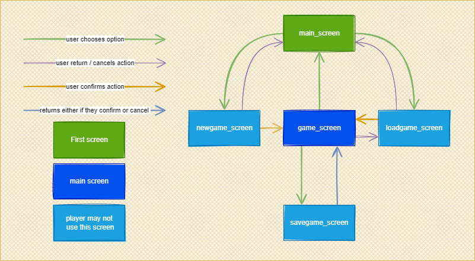
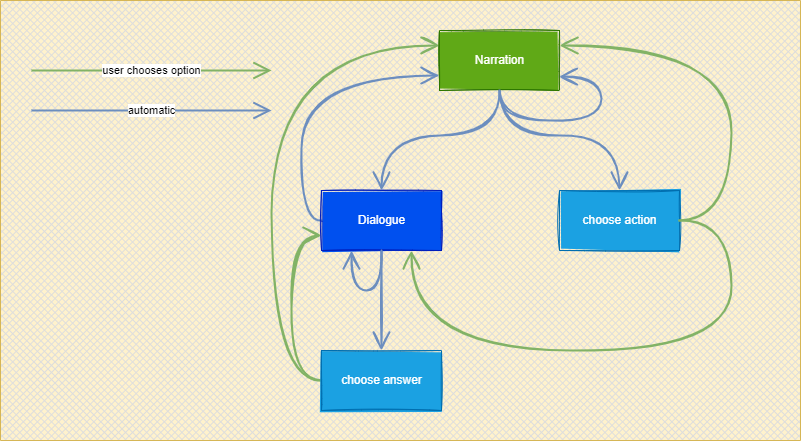

# VN

## Framework

### GameLoop

The game loop start when player opens the app, triggering the main menu, and end when player closes the app, either by selecting the exit option or by clossing the window.

### How screen flow work

Screens are spaces where Player can use specifics options.
There are five standard screens:

1. **Main screen**, where main menu is placed.
2. **Game screen**, where the Player enjoys the game experience.
3. **New game screen**, where new games are created.
4. **Load game screen**, where previous game can be continued.
5. **Save game screen**, where Player can save the current game data.

### How scene flow work

An scene start with a narration.

From the narration, a story can continue with:

- Another narration.
- An dialogue
- Letting the player decide whether to do one thing or another

An action can trigger an dialogue or another narration.

The dialogues can end without the necesity of the player asking to the character, but also they can require to the player to answer. And, of course, an dialogue can be followed by another dialogue.

After the player chooses an answer, the story can continue with the narration or dialogue.

